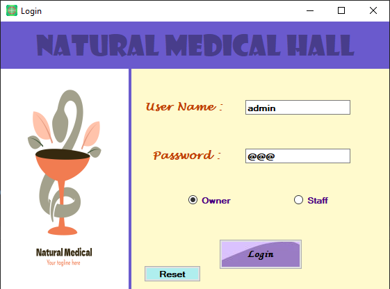
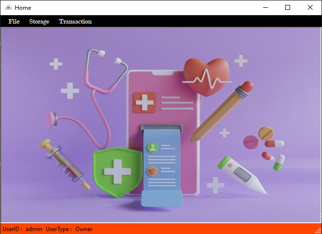
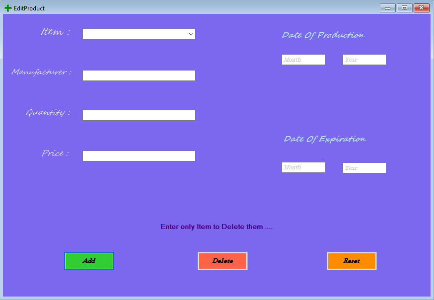
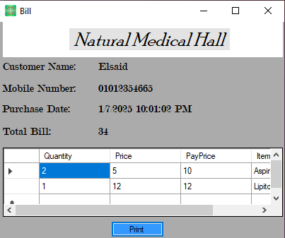

# Pharmacy Management Software

A **Windows Forms-based application** built in **C#** with an **SQL Database** to help pharmacists manage daily operations like inventory, transactions, and billing.

---

## Table of Contents

1. [Introduction](#introduction)
2. [Features](#features)
3. [Technologies Used](#technologies-used)
4. [Prerequisites](#prerequisites)
5. [Database](#database)
6. [Source Code](#source-code)
7. [Screenshots](#screenshots)
8. [Disclaimer](#disclaimer)

---

## Introduction

This software simplifies pharmacy management by providing tools to:

- Manage user accounts and roles.
- Track inventory (medicines, stock levels, etc.).
- Process sales transactions and generate bills.
- Maintain a history of all transactions for reporting.

Built with **C#** and **SQL Server**, it’s designed for efficiency and ease of use.

---

## Features

- **User Management**: Login, signup, and role-based access (admin, pharmacist).
- **Inventory Management**: Add, update, and delete items. Track stock levels.
- **Transactions**: Process sales, generate bills, and maintain transaction history.
- **Reporting**: View sales and inventory reports.

---

## Technologies Used

- **Frontend**: Windows Forms (C#)
- **Backend**: C# (.NET Framework)
- **Database**: SQL Server
- **Reporting**: Crystal Reports or RDLC (for bills and reports)

---

## Prerequisites

To run the application, you need:

1. **.NET Framework** (version 4.7 or higher).
2. **SQL Server** (Express or higher).
3. **Visual Studio** (2019 or later).

---

## Database

The application uses an **SQL Database** with the following tables:

1. **Users**: Stores user credentials and roles.
2. **Inventory**: Tracks item details (name, price, quantity, expiry date).
3. **Transactions**: Records sales transactions.
4. **TransactionDetails**: Links transactions to items sold.

---

## Source Code

The project is organized as follows:

- **`Forms`**: Windows Forms for the UI.
- **`Models`**: Data models for database entities.
- **`Services`**: Business logic and database operations.
- **`Utilities`**: Helper classes (e.g., hashing, validation).

### Setup:
1. Clone the repository.
2. Restore the database using the provided SQL scripts.
3. Update the connection string in `app.config`.
4. Build and run the application in Visual Studio.

---

## Screenshots

### Key Functionalities

- **Login Page**  
  

- **Dashboard**  
  

- **Inventory Management**  
  

- **Generate Bill**  
  

---

## Disclaimer

All images and icons are sourced from free resources. If any content violates copyright, please contact me for removal.

---

**Explore the project to see its full capabilities!**
